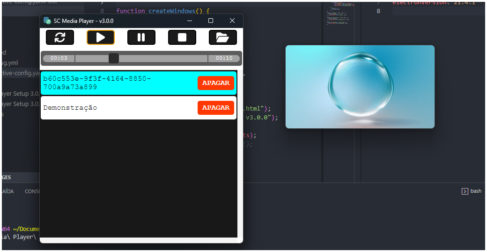

# SC Media Player

## App em electron para reproduzir midias numa sengunda tela



## ROADMAP

- [X] Dual screen
- [X] Persistencia de dados (.sqlite)
- [X] Reprodução de midias
- [X] Criar lista de mídias
- [ ] Imagem como 'descanço'
- [ ] Thumb das midias
- [ ] Volume dos vídeos
- [X] Barra de progresso do vídeo

## Como usar

```bash
git clone https://github.com/saulotarsobc/SC-Media-Player.git;
cd SC-Media-Player;
yarn install;
yarn start;
# gerar um .exe que ficará na pasta 'dist'
yarn win;
```
